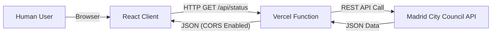

# Software Design Document: ¿Está abierto el Retiro? (Is Retiro Open?)

## 1. Introduction

### 1.1 Purpose
The purpose of this document is to outline the architecture and design for "Is Retiro Open?", a lightweight web application. The application answers a single question: "Is Retiro Park in Madrid open right now?" It provides a clear visual indicator and detailed status information based on real-time data from the Madrid City Council.

### 1.2 Scope
- **Target Audience:** Residents and tourists in Madrid.
- **Localization:** **Spanish First**, with English translations for key status text.
- **Key Functionality:** Real-time status checking, color-coded accessibility interface, description of restrictions.
- **Constraints:** Frontend-focused with a lightweight serverless proxy to handle CORS and caching.

## 2. Architecture Overview

The application follows a **Serverless / JAMstack Architecture**.

- **Hosting:** Vercel (Frontend & Serverless Functions).
- **Client:** React (Vite) Single Page Application.
- **Proxy Layer:** A simple Vercel Serverless Function to fetch data from the Madrid API, handling CORS and caching.
- **Data Source:** Madrid City Council (Ayuntamiento de Madrid) ESRI REST API.



## 3. Data Source Integration

### 3.1 External API Endpoint
- **URL:** `https://sigma.madrid.es/hosted/rest/services/MEDIO_AMBIENTE/ALERTAS_PARQUES/MapServer/0/query`
- **Method:** `GET`
- **Layer Reliability:** The application targets Layer `0`. To ensure robustness, the fetcher will verify the layer name corresponds to "ALERTAS CLIMATOLOGICAS PARQUES" or fail gracefully.

### 3.2 Internal Proxy Endpoint (`/api/status`)
The client will request this internal endpoint to avoid CORS issues and ensure consistent headers.
- **Cache Strategy:** `s-maxage=60, stale-while-revalidate=30` (1-minute freshness to accommodate rapid weather changes).

### 3.3 Data Mapping
**Timezone Rule:** All time displays must be strictly formatted in **Europe/Madrid** time, regardless of the user's local device time.

The API returns `ALERTA_DESCRIPCION` (SmallInteger) and `HORARIO_INCIDENCIA` (String).

| API Code | Meaning | UI State (Big Text) | Theme Color | Text Color | UI Description (ES/EN) |
|----------|---------|---------------------|-------------|------------|------------------------|
| **1** | Abierto | **SÍ / YES** | **Green** (`#2ECC71`) | White | Abierto en horario habitual.<br>*Open regular hours.* |
| **2** | Incidencias | **SÍ / YES*** | **Blue** (`#3498DB`) | White | **Incidencias:** [Display `OBSERVACIONES` field].<br>*Incidents reported.* |
| **3** | Alerta Amarilla | **SÍ / YES*** | **Yellow** (`#F1C40F`) | **Black** | **Precaución:** Zonas infantiles y deportivas restringidas.<br>*Caution: Restricted access to specific zones.* |
| **4** | Alerta Naranja | **RESTRINGIDO / RESTRICTED** | **Orange** (`#E67E22`) | White | **Eventos suspendidos.** Se recomienda no permanecer en el parque.<br>*Events suspended. Recommendation: Do not stay in the park.* |
| **5** | Previsión Roja | **CERRANDO / CLOSING** | **Red** (`#E74C3C`) | White | **Previsión de cierre:** [Display `HORARIO_INCIDENCIA`].<br>*Forecast to close during these hours.* |
| **6** | Cerrado | **NO** | **Dark Red** (`#C0392B`) | White | **Cerrado:** [Display `HORARIO_INCIDENCIA`].<br>*Closed.* |

*Note: Code 5 (Forecast Red) is mapped to "CLOSING" rather than "NO" to accurately reflect that the park might still be open at the exact moment of checking, but a closure is imminent.*

## 4. Frontend Design

### 4.1 Technology Stack
- **Framework:** React 18 + TypeScript (via Vite).
- **Styling:** Tailwind CSS (for reliable utility classes and contrast management).
- **Icons:** Lucide React (minimalist icons).

### 4.2 User Interface (UI)

#### Layout
1.  **Header:** "¿Está abierto el Retiro?" / "Is Retiro Open?"
2.  **Main Status Card:**
    *   **Background:** Full screen or large central card changing color based on state.
    *   **Primary Text:** Huge, bold font (e.g., "SÍ").
    *   **Secondary Text:** Smaller English translation (e.g., "YES").
    *   **Detail Section:** Warning icon + Description of restrictions + Time range (if applicable).
3.  **Footer:**
    *   "Datos facilitados por el Ayuntamiento de Madrid".
    *   Last Updated timestamp (Madrid Time).
    *   Link to Official Page: `https://www.madrid.es`

#### Accessibility
- **Contrast:** Yellow background (#F1C40F) MUST use black text (#000000) for WCAG AA compliance. All other backgrounds use White (#FFFFFF).
- **Screen Readers:** Status text must use `role="status"` and `aria-live="polite"`.

## 5. Technical Implementation Details

### 5.1 Request Logic & Resilience
1.  **Fetch:** Request `/api/status`.
2.  **Retry Strategy:** On network failure, retry 3 times with exponential backoff (1s, 2s, 4s).
3.  **Timeout:** Abort request after 8 seconds.

### 5.2 JSON Schema
The proxy response will normalize the data structure:
```json
{
  "status": "open", // open, restricted, closing, closed
  "code": 1, // The original integer code
  "message": "Abierto según horario habitual",
  "incidents": "09:00 a 21:00", // mapped from HORARIO_INCIDENCIA
  "updated_at": "2026-01-30T10:00:00+01:00"
}
```

### 5.3 Error Handling States
*   **Network Error:** (User offline) -> Grey Background. Message: "Sin conexión / No internet".
*   **API Error:** (Madrid API down) -> Grey Background. Message: "Error obteniendo datos / Error fetching data". Link: "Ver web oficial" (Check official site).

## 6. Development & Testing

### 6.1 Mock Mode
To facilitate testing of Red/Closed states without waiting for a storm, the application will support a query parameter:
*   `?mock=true`: Randomly cycles through states.
*   `?code=6`: Forces a specific state (e.g., Closed).

### 6.2 License & Attribution
Data is used under the *Madrid Open Data* license.
- **Requirement:** Attribution to "Ayuntamiento de Madrid" is mandatory and included in the footer.
