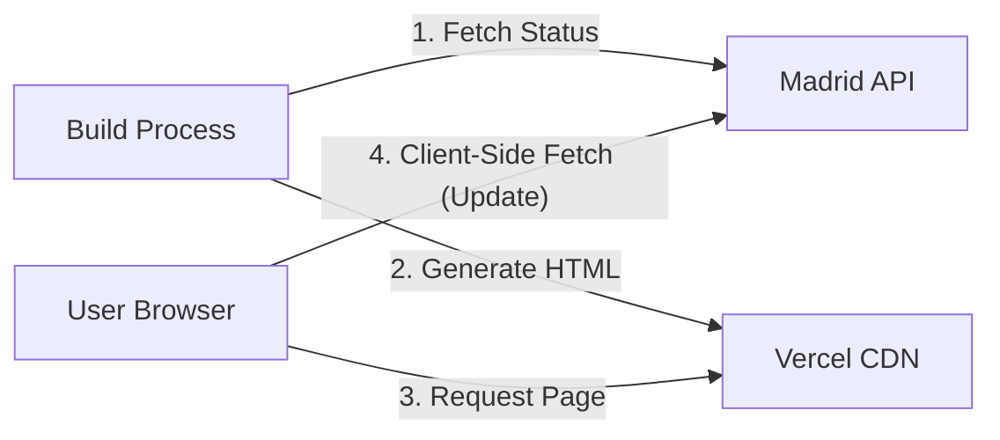

# Software Design Document: ¿Está abierto el Retiro? (Is Retiro Open?)

## 1. Introduction

### 1.1 Purpose
The purpose of this document is to outline the architecture and design for "Is Retiro Open?", a lightweight web application. The application answers a single question: "Is Retiro Park in Madrid open right now?" It provides a clear visual indicator and detailed status information based on real-time data from the Madrid City Council.

### 1.2 Scope
- **Target Audience:** Residents and tourists in Madrid.
- **Localization:** **Spanish First**, with English translations for key status text.
- **Key Functionality:** Real-time status checking, color-coded accessibility interface, description of restrictions.
- **Constraints:** Frontend-focused with hybrid SSG + Client-Side Fetching for performance and resilience.

## 2. Architecture Overview

The application follows a **Hybrid Static Site Generation (SSG)** architecture with **Client-Side Revalidation**.

- **Hosting:** Vercel (Static Hosting / CDN).
- **Client:** React 19 (Vite) Single Page Application.
- **Data Source:** Madrid City Council (Ayuntamiento de Madrid) ESRI REST API.
- **Build Strategy:**
  - **Build Time (SSG):** The `prerender.ts` script fetches the *current* status from the Madrid API and generates a pre-rendered `index.html`. This ensures users receive meaningful content (not a spinner) immediately on load.
  - **Deployment Automation:** A GitHub Action triggers a Vercel rebuild every 60 minutes to keep the static HTML fresh.
- **Run Time (Client):**
  - **Hydration:** React hydrates the pre-rendered HTML.
  - **Background Revalidation:** The client immediately (and then every 60 seconds) fetches the latest status from the Madrid API (CORS enabled) to ensure the data is up-to-the-second fresh.



## 3. Data Source Integration

### 3.1 External API Endpoint
- **URL:** `https://sigma.madrid.es/hosted/rest/services/MEDIO_AMBIENTE/ALERTAS_PARQUES/MapServer/0/query`
- **Method:** `GET`
- **CORS:** Enabled by the provider (`Access-Control-Allow-Origin: *`).
- **Layer Reliability:** The application verifies the layer name includes "ALERTAS" to ensure data integrity.

### 3.2 Data Mapping
**Timezone Rule:** All time displays must be strictly formatted in **Europe/Madrid** time, regardless of the user's local device time.

| API Code | Meaning | UI State (Big Text) | Theme Color | Text Color | UI Description (ES/EN) |
|----------|---------|---------------------|-------------|------------|------------------------|
| **1** | Abierto | **SÍ / YES** | **Green** (`#2ECC71`) | White | Abierto en horario habitual.<br>*Open regular hours.* |
| **2** | Incidencias | **SÍ / YES*** | **Blue** (`#3498DB`) | White | **Incidencias:** [Display `OBSERVACIONES` field].<br>*Incidents reported.* |
| **3** | Alerta Amarilla | **SÍ / YES*** | **Yellow** (`#F1C40F`) | **Black** | **Precaución:** Zonas infantiles y deportivas restringidas.<br>*Caution: Restricted access to specific zones.* |
| **4** | Alerta Naranja | **RESTRINGIDO / RESTRICTED** | **Orange** (`#E67E22`) | White | **Eventos suspendidos.** Se recomienda no permanecer en el parque.<br>*Events suspended. Recommendation: Do not stay in the park.* |
| **5** | Previsión Roja | **CERRANDO / CLOSING** | **Red** (`#E74C3C`) | White | **Previsión de cierre:** [Display `HORARIO_INCIDENCIA`].<br>*Forecast to close during these hours.* |
| **6** | Cerrado | **NO** | **Dark Red** (`#C0392B`) | White | **Cerrado:** [Display `HORARIO_INCIDENCIA`].<br>*Closed.* |

## 4. Frontend Design

### 4.1 Technology Stack
- **Framework:** React 19 + TypeScript (via Vite).
- **Styling:** Tailwind CSS 4.
- **Icons:** Lucide React.
- **Build Tooling:** `tsx` for TypeScript execution during build.

### 4.2 User Interface (UI)
- **Primary View:** Large status card with color-coded background.
- **Accessibility:** High contrast (WCAG AA), ARIA roles for status updates.
- **Localization:** Spanish is the default state (baked into HTML). English is available via hydration if detected.

## 5. Technical Implementation Details

### 5.1 Request Logic & Resilience
1.  **Shared Logic:** Both the build script and client hook use a shared utility (`src/utils/madridApi.ts`) to fetch and parse data.
2.  **Retry Strategy:** On network failure, retry 3 times with exponential backoff (1s, 2s, 4s).
3.  **Timeout:** Abort request after 8 seconds.
4.  **Build Failure:** If the API is unreachable during the build process, the build **fails** (exit code 1) to prevent deploying stale or "default open" data.
5.  **Client Error:** If the client cannot reach the API, it retains the pre-rendered (stale) data if available, or shows an "Offline" state.

### 5.2 Internal Data Model
```typescript
interface RetiroStatus {
  status: "open" | "restricted" | "closing" | "closed";
  code: 1 | 2 | 3 | 4 | 5 | 6;
  message: string;
  incidents: string | null;
  observations: string | null;
  updated_at: string; // ISO String
}
```

## 6. Development & Testing

### 6.1 Mock Mode
To facilitate testing of Red/Closed states without waiting for a storm, the application supports query parameters:
*   `?mock=true`: Randomly cycles through states (simulating network delay).
*   `?code=6`: Forces a specific state (e.g., Closed).

### 6.2 License & Attribution
Data is used under the *Madrid Open Data* license.
- **Requirement:** Attribution to "Ayuntamiento de Madrid" is mandatory and included in the footer.
