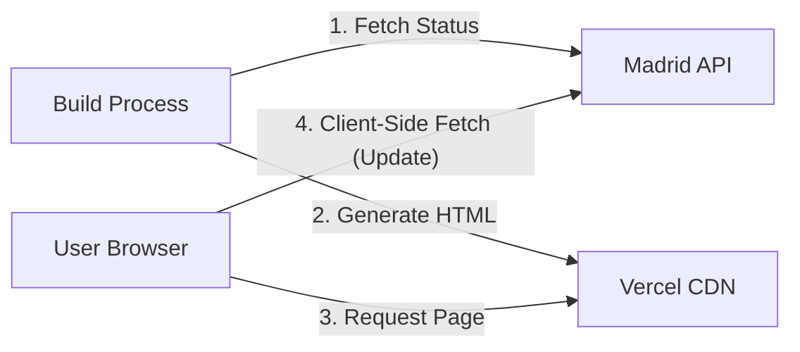

# Software Design Document: ¿Está abierto el Retiro? (Is Retiro Open?)

## 1. Introduction

### 1.1 Purpose

The purpose of this document is to outline the architecture and design for "Is
Retiro Open?", a lightweight web application. The application answers a single
question: "Is Retiro Park in Madrid open right now?" It provides a clear visual
indicator and detailed status information based on real-time data from the
Madrid City Council.

### 1.2 Scope

- **Target Audience:** Residents and tourists in Madrid.
- **Localization:** **Spanish First**, with English translations for key status
  text.
- **Key Functionality:** Real-time status checking, color-coded accessibility
  interface, description of restrictions.
- **Constraints:** Frontend-focused with hybrid SSG + Client-Side Fetching for
  performance and resilience.

## 2. Architecture Overview

The application follows a **Hybrid Static Site Generation (SSG)** architecture
with **Client-Side Revalidation**.

- **Hosting:** Vercel (Static Hosting / CDN).
- **Client:** React 19 (Vite) Single Page Application.
- **Data Source:** Madrid City Council (Ayuntamiento de Madrid) ESRI REST API.
- **Build Strategy:**
  - **Build Time (SSG):** The `prerender.ts` script fetches the _current_ status
    from the Madrid API and generates a pre-rendered `index.html`. This ensures
    users receive meaningful content (not a spinner) immediately on load.
  - **Deployment Automation:** A GitHub Action triggers a Vercel rebuild every
    60 minutes to keep the static HTML fresh.
- **Run Time (Client):**
  - **Hydration:** React hydrates the pre-rendered HTML.
  - **Background Revalidation:** The client immediately (and then every 60
    seconds) fetches the latest status from the Madrid API (CORS enabled) to
    ensure the data is up-to-the-second fresh.



## 3. Data Source Integration

### 3.1 External API Endpoint

- **URL:**
  `https://sigma.madrid.es/hosted/rest/services/MEDIO_AMBIENTE/ALERTAS_PARQUES/MapServer/0/query`
- **Method:** `GET`
- **CORS:** Enabled by the provider (`Access-Control-Allow-Origin: *`).
- **Layer Reliability:** The application verifies the layer name includes
  "ALERTAS" to ensure data integrity.

### 3.2 Data Mapping

**Timezone Rule:** All time displays must be strictly formatted in
**Europe/Madrid** time, regardless of the user's local device time.

| API Code | Meaning         | UI State (Big Text)          | Theme Color              | Text Color | UI Description (ES/EN)                                                                                                             |
| -------- | --------------- | ---------------------------- | ------------------------ | ---------- | ---------------------------------------------------------------------------------------------------------------------------------- |
| **1**    | Abierto         | **SÍ / YES**                 | **Green** (`#2ECC71`)    | White      | Abierto en horario habitual.<br>_Open regular hours._                                                                              |
| **2**    | Incidencias     | **SÍ / YES***                | **Blue** (`#3498DB`)     | White      | **Incidencias:** [Display `OBSERVACIONES` field].<br>_Incidents reported._                                                         |
| **3**    | Alerta Amarilla | **SÍ / YES***                | **Yellow** (`#F1C40F`)   | **Black**  | **Precaución:** Zonas infantiles y deportivas restringidas.<br>_Caution: Restricted access to specific zones._                     |
| **4**    | Alerta Naranja  | **RESTRINGIDO / RESTRICTED** | **Orange** (`#E67E22`)   | White      | **Eventos suspendidos.** Se recomienda no permanecer en el parque.<br>_Events suspended. Recommendation: Do not stay in the park._ |
| **5**    | Previsión Roja  | **CERRADO / CLOSED**         | **Dark Red** (`#C0392B`) | White      | **Cerrado:** [Display `HORARIO_INCIDENCIA`].<br>_Closed due to weather alert (Standard Red Alert)._                                |
| **6**    | Cerrado         | **CERRADO / CLOSED**         | **Dark Red** (`#C0392B`) | White      | **Cerrado:** [Display `HORARIO_INCIDENCIA`].<br>_Closed due to weather alert (Emergency Closure)._                                 |

> **Note on Code 5:** Historically treated as "Closing", empirical evidence
> confirms that Code 5 represents a standard "Red Alert" where gates are locked
> and access is prohibited, indistinguishable from Code 6 for the end user.

## 4. Frontend Design

### 4.1 Technology Stack

- **Framework:** React 19 + TypeScript (via Vite).
- **Styling:** Tailwind CSS 4.
- **Icons:** Lucide React.
- **Build Tooling:** `tsx` for TypeScript execution during build.

### 4.2 User Interface (UI)

- **Primary View:** Large status card with color-coded background.
- **Accessibility:** High contrast (WCAG AA), ARIA roles for status updates.
- **Localization:** Spanish is the default state (baked into HTML). English is
  available via hydration if detected.

## 5. Technical Implementation Details

### 5.1 Request Logic & Resilience

1. **Shared Logic:** Both the build script and client hook use a shared utility
   (`src/utils/madridApi.ts`) to fetch and parse data.
2. **Retry Strategy:** On network failure, retry 3 times with exponential
   backoff (1s, 2s, 4s).
3. **Timeout:** Abort request after 8 seconds.
4. **Build Failure:** If the API is unreachable during the build process, the
   build **fails** (exit code 1) to prevent deploying stale or "default open"
   data.
5. **Client Error:** If the client cannot reach the API, it retains the
   pre-rendered (stale) data if available, or shows an "Offline" state.

### 5.2 Internal Data Model

```typescript
interface RetiroStatus {
  status: "open" | "restricted" | "closed";
  code: 1 | 2 | 3 | 4 | 5 | 6;
  message: string;
  incidents: string | null;
  observations: string | null;
  updated_at: string; // ISO String
}
```

## 6. Development & Testing

### 6.1 Mock Mode

To facilitate testing of Red/Closed states without waiting for a storm, the
application supports query parameters:

- `?mock=true`: Randomly cycles through states (simulating network delay).
- `?code=6`: Forces a specific state (e.g., Closed).

### 6.2 License & Attribution

Data is used under the _Madrid Open Data_ license.

- **Requirement:** Attribution to "Ayuntamiento de Madrid" is mandatory and
  included in the footer.

## 7. Rich Media Preview (Open Graph)

### 7.1 Purpose

Enable rich link previews when sharing the site URL on social media and
messaging apps. The preview image reflects the current park status at build
time.

### 7.2 Approach: Static Images

There are 6 status codes × 2 locales = 12 possible OG images. Since content is
fully determined at build time, we use **pre-generated static images** rather
than runtime generation. This eliminates Edge Function complexity, font loading,
caching strategies, and runtime failure modes.

```
public/og/
├── es-1.png   # Green, "SÍ"
├── es-2.png   # Blue, "SÍ"
├── es-3.png   # Yellow, "SÍ"
├── es-4.png   # Orange, "RESTRINGIDO"
├── es-5.png   # Red, "CERRADO"
├── es-6.png   # Red, "CERRADO"
├── en-1.png   # Green, "YES"
├── en-2.png   # Blue, "YES"
├── en-3.png   # Yellow, "YES"
├── en-4.png   # Orange, "RESTRICTED"
├── en-5.png   # Red, "CLOSED"
└── en-6.png   # Red, "CLOSED"
```

Each image is 1200×630px with the layout:

```
┌─────────────────────────────────────────────────────────────┐
│                  [Background: Theme Color]                  │
│                                                             │
│              ¿Está abierto el Retiro?                       │
│                       (48px)                                │
│                                                             │
│                          SÍ                                 │
│                      (180px bold)                           │
│                                                             │
└─────────────────────────────────────────────────────────────┘
```

Colors match `STATUS_THEMES` from Section 3.2. Images are generated once using
any design tool (Figma, Canva, ImageMagick, etc.) and committed to the repo.

### 7.3 Implementation

#### 7.3.1 Meta Tags (`index.html`)

```html
<!-- Open Graph -->
<meta property="og:type" content="website" />
<meta property="og:url" content="__OG_URL__" />
<meta property="og:title" content="__OG_TITLE__" />
<meta property="og:description" content="__OG_DESCRIPTION__" />
<meta property="og:image" content="__OG_IMAGE__" />
<meta property="og:image:width" content="1200" />
<meta property="og:image:height" content="630" />
<meta property="og:image:alt" content="__OG_IMAGE_ALT__" />
<meta property="og:locale" content="__OG_LOCALE__" />

<!-- Twitter/X card type (falls back to OG for other fields) -->
<meta name="twitter:card" content="summary_large_image" />
```

#### 7.3.2 Prerender Updates (`prerender.ts`)

```typescript
const SITE_URL = "https://isretiroopen.com";

const OG_STATUS: Record<number, { es: string; en: string }> = {
  1: { es: "SÍ", en: "YES" },
  2: { es: "SÍ", en: "YES" },
  3: { es: "SÍ", en: "YES" },
  4: { es: "RESTRINGIDO", en: "RESTRICTED" },
  5: { es: "CERRADO", en: "CLOSED" },
  6: { es: "CERRADO", en: "CLOSED" },
};

const OG_DESCRIPTIONS: Record<number, { es: string; en: string }> = {
  1: { es: "El Retiro está abierto.", en: "Retiro Park is open." },
  2: {
    es: "El Retiro está abierto con incidencias.",
    en: "Retiro Park is open with incidents.",
  },
  3: {
    es: "El Retiro está abierto con precaución.",
    en: "Retiro Park is open with caution.",
  },
  4: {
    es: "El Retiro tiene acceso restringido.",
    en: "Retiro Park has restricted access.",
  },
  5: { es: "El Retiro está cerrado.", en: "Retiro Park is closed." },
  6: { es: "El Retiro está cerrado.", en: "Retiro Park is closed." },
};

const OG_TITLES = { es: "¿Está abierto el Retiro?", en: "Is Retiro Open?" };
const OG_LOCALES = { es: "es_ES", en: "en_GB" };

// Inside locale loop:
const code = statusData.code;
const ogImage = `${SITE_URL}/og/${locale}-${code}.png`;

html = html
  .replaceAll(
    "__OG_URL__",
    locale === "es" ? SITE_URL : `${SITE_URL}/${locale}`,
  )
  .replaceAll("__OG_TITLE__", OG_TITLES[locale])
  .replaceAll("__OG_DESCRIPTION__", OG_DESCRIPTIONS[code][locale])
  .replaceAll("__OG_IMAGE__", ogImage)
  .replaceAll(
    "__OG_IMAGE_ALT__",
    `${OG_TITLES[locale]} ${OG_STATUS[code][locale]}`,
  )
  .replaceAll("__OG_LOCALE__", OG_LOCALES[locale]);
```

### 7.4 File Changes

| File              | Action | Description                        |
| ----------------- | ------ | ---------------------------------- |
| `index.html`      | Modify | Add OG meta tag placeholders       |
| `public/og/*.png` | Create | 12 static images (1200×630, once)  |
| `prerender.ts`    | Modify | Select correct image, replace tags |

No new dependencies required.

### 7.5 Testing

Validate with [opengraph.xyz](https://opengraph.xyz) or
[Facebook Sharing Debugger](https://developers.facebook.com/tools/debug/).
Confirm `view-source:` shows resolved URLs (no `__PLACEHOLDER__` text).
