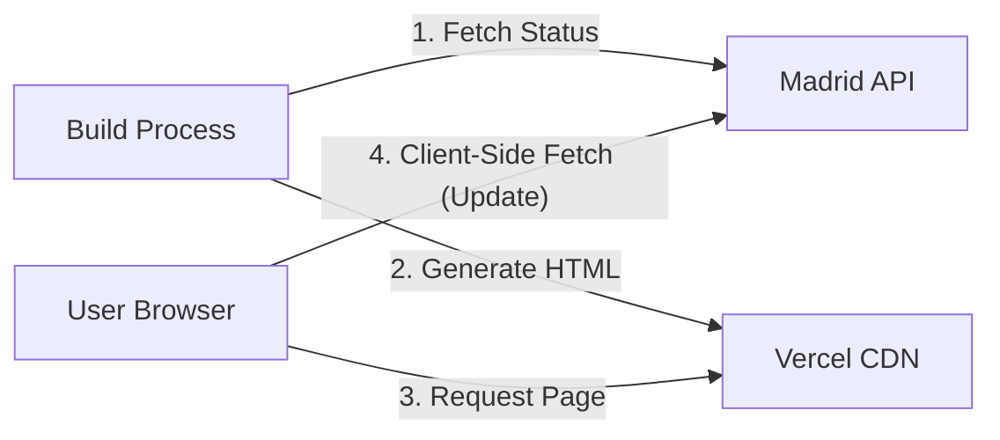

# Software Design Document: ¿Está abierto el Retiro? (Is Retiro Open?)

## 1. Introduction

### 1.1 Purpose

The purpose of this document is to outline the architecture and design for "Is
Retiro Open?", a lightweight web application. The application answers a single
question: "Is Retiro Park in Madrid open right now?" It provides a clear visual
indicator and detailed status information based on real-time data from the
Madrid City Council.

### 1.2 Scope

- **Target Audience:** Residents and tourists in Madrid.
- **Localization:** **Spanish First**, with English translations for key status
  text.
- **Key Functionality:** Real-time status checking, color-coded accessibility
  interface, description of weather/protocol restrictions.
- **Functional Scope:** Status is derived from Madrid's park meteorological
  alert protocol (codes 1-6) plus AEMET warning cross-checks.
- **Out of Scope:** Extraordinary non-weather closures (e.g., fire, police or
  security incidents, public health restrictions, maintenance or event
  closures) unless explicitly reflected in the municipal alert feed.
- **Constraints:** Frontend-focused with hybrid SSG + Client-Side Fetching for
  performance and resilience.

## 2. Architecture Overview

The application follows a **Hybrid Static Site Generation (SSG)** architecture
with **Client-Side Revalidation**.

- **Hosting:** Vercel (Static Hosting / CDN).
- **Client:** React 19 (Vite) Single Page Application.
- **Data Source:** Madrid City Council (Ayuntamiento de Madrid) ESRI REST API.
- **Build Strategy:**
  - **Build Time (SSG):** The `prerender.ts` script fetches the _current_ status
    from the Madrid API and generates a pre-rendered `index.html`. This ensures
    users receive meaningful content (not a spinner) immediately on load.
  - **Deployment Automation:** A GitHub Action triggers a Vercel rebuild every
    60 minutes to keep the static HTML fresh.
- **Run Time (Client):**
  - **Hydration:** React hydrates the pre-rendered HTML.
  - **Background Revalidation:** The client immediately (and then every 60
    seconds) fetches the latest status from the Madrid API (CORS enabled) to
    ensure the data is up-to-the-second fresh.



## 3. Data Source Integration

### 3.1 External API Endpoint

- **URL:**
  `https://sigma.madrid.es/hosted/rest/services/MEDIO_AMBIENTE/ALERTAS_PARQUES/MapServer/0/query`
- **Method:** `GET`
- **CORS:** Enabled by the provider (`Access-Control-Allow-Origin: *`).
- **Layer Reliability:** The application verifies the layer name includes
  "ALERTAS" to ensure data integrity.
- **Dataset Scope:** This source is an alerts feed for meteorological park
  protocol states, not a complete taxonomy of all closure causes.

### 3.2 Data Mapping

**Timezone Rule:** All time displays must be strictly formatted in
**Europe/Madrid** time, regardless of the user's local device time.

| API Code | Meaning         | UI State (Big Text)    | Theme Color              | Text Color | UI Description (ES/EN)                                                                                                             |
| -------- | --------------- | ---------------------- | ------------------------ | ---------- | ---------------------------------------------------------------------------------------------------------------------------------- |
| **1**    | Abierto         | **ABIERTO / OPEN**     | **Green** (`#2ECC71`)    | White      | Abierto en horario habitual.<br>_Open regular hours._                                                                              |
| **2**    | Incidencias     | **ABIERTO\* / OPEN\*** | **Blue** (`#3498DB`)     | White      | **Incidencias:** [Display `OBSERVACIONES` field].<br>_Incidents reported._                                                         |
| **3**    | Alerta Amarilla | **ABIERTO\* / OPEN\*** | **Yellow** (`#F1C40F`)   | **Black**  | **Precaución:** Se restringe el acceso a zonas infantiles, deportivas y de mayores, y a los Jardines de Cecilio Rodríguez (acceso al Pabellón por la puerta del Paseo de Uruguay). Se recomienda no permanecer bajo el arbolado.<br>_Caution: Access is restricted to children's, sports, and senior areas, and Cecilio Rodríguez Gardens (Pavilion access via the Paseo de Uruguay gate). Do not stay under trees._ |
| **4**    | Alerta Naranja  | **ABIERTO\* / OPEN\*** | **Orange** (`#E67E22`)   | White      | **Restricciones de acceso:** zonas infantiles, deportivas y de mayores; área canina, Pinar de San Blas, Cementerio, Planteles, Jardines de Cecilio Rodríguez y Jardines de Herrero Palacios. **Eventos al aire libre suspendidos.** Se recomienda abandonar el parque si no es imprescindible permanecer.<br>_Access restrictions apply to designated areas; outdoor events are suspended. Recommendation: leave the park unless staying is essential._ |
| **5**    | Previsión Roja  | **CERRADO / CLOSED**   | **Dark Red** (`#C0392B`) | White      | **Cerrado:** [Display `HORARIO_INCIDENCIA`].<br>_Closed due to weather alert (Standard Red Alert)._                                |
| **6**    | Cerrado         | **CERRADO / CLOSED**   | **Dark Red** (`#C0392B`) | White      | **Cerrado:** [Display `HORARIO_INCIDENCIA`].<br>_Closed due to weather alert (Emergency Closure)._                                 |

> **Note on Code 5:** Historically treated as "Closing", empirical evidence
> confirms that Code 5 represents a standard "Red Alert" where gates are locked
> and access is prohibited, indistinguishable from Code 6 for the end user.

## 4. Frontend Design

### 4.1 Technology Stack

- **Framework:** React 19 + TypeScript (via Vite).
- **Styling:** Tailwind CSS 4.
- **Icons:** Lucide React.
- **Build Tooling:** `tsx` for TypeScript execution during build.

### 4.2 User Interface (UI)

- **Primary View:** Large status card with color-coded background.
- **Accessibility:** High contrast (WCAG AA), ARIA roles for status updates.
- **Localization:** Spanish is the default state (baked into HTML). English is
  available via hydration if detected.

## 5. Technical Implementation Details

### 5.1 Request Logic & Resilience

1. **Shared Logic:** Both the build script and client hook use a shared utility
   (`src/utils/madridApi.ts`) to fetch and parse data.
2. **Retry Strategy:** On network failure, retry 3 times with exponential
   backoff (1s, 2s, 4s).
3. **Timeout:** Abort request after 8 seconds.
4. **Build Failure:** If the API is unreachable during the build process, the
   build **fails** (exit code 1) to prevent deploying stale or "default open"
   data.
5. **Client Error:** If the client cannot reach the API, it retains the
   pre-rendered (stale) data if available, or shows an "Offline" state.

### 5.2 Internal Data Model

```typescript
interface RetiroStatus {
  status: "open" | "restricted" | "closed";
  code: 1 | 2 | 3 | 4 | 5 | 6;
  message: string;
  incidents: string | null;
  observations: string | null;
  updated_at: string; // ISO String - when we fetched the data
  source_updated_at: string | null; // "DD/MM/YYYY" - when Madrid updated the alert (FECHA_INCIDENCIA)
}
```

### 5.3 Stale Data Warning

The Madrid API provides `FECHA_INCIDENCIA`, the date when they last updated the
alert status.

#### Stale Data Detection

If `source_updated_at` is **yesterday or older** (compared to today in Madrid
timezone), the UI shows a warning:

- Instead of "Actualizado: 14:32, 3 feb" (our fetch time)
- Show "Última actualización: 2 feb" (Madrid's update date)

This alerts users when the source data may be outdated, even though our site is
fetching fresh data.

```text
| Status shown | Stale data? | UI behavior                            |
|--------------|-------------|----------------------------------------|
| Code 1-6     | No          | (nothing)                              |
| Code 1-6     | Yes         | "Última actualización: {date}"         |
```

**Design rationale:** When data is fresh, no timestamp is shown - users don't
need to know when we last checked if everything is current. The stale data
warning only appears when actionable.

**Note:** Verification links for uncertain states are handled by the AEMET
weather warning integration (see Section 8).

## 6. Development & Testing

### 6.1 Mock Mode

To facilitate testing of confirmed and predictive closure states without waiting
for live weather events, the application supports query parameters:

- `?mock=true`: Enables mock mode for park + warning data.
- `?code=1..6`: Forces a specific park state from the Madrid status feed.
- `?warningScenario=none|active|soon|later`: Forces predictive warning state.
- `?warning=true|false`: Legacy warning mock flag (maps to `active`/`none`).

Example URLs:

- `?mock=true&code=1&warningScenario=none` (open, no advisory)
- `?mock=true&code=1&warningScenario=active` (likely closed now advisory)
- `?mock=true&code=1&warningScenario=soon` (closing soon advisory)
- `?mock=true&code=1&warningScenario=later` (closing later today advisory)
- `?mock=true&code=6&warningScenario=none` (officially closed)

### 6.2 License & Attribution

Data is used under the _Madrid Open Data_ license.

- **Requirement:** Attribution to "Ayuntamiento de Madrid" is mandatory and
  included in the footer.

## 7. Rich Media Preview (Open Graph)

### 7.1 Purpose

Enable rich link previews when sharing the site URL on social media and
messaging apps. The preview image reflects the current park status at build
time.

### 7.2 Approach: Static Images

There are 6 status codes × 2 locales = 12 possible OG images. Since content is
fully determined at build time, we use **pre-generated static images** rather
than runtime generation. This eliminates Edge Function complexity, font loading,
caching strategies, and runtime failure modes.

```text
public/og/
├── es-1.png   # Green, "ABIERTO"
├── es-2.png   # Blue, "ABIERTO*"
├── es-3.png   # Yellow, "ABIERTO*"
├── es-4.png   # Orange, "ABIERTO*"
├── es-5.png   # Red, "CERRADO"
├── es-6.png   # Red, "CERRADO"
├── en-1.png   # Green, "OPEN"
├── en-2.png   # Blue, "OPEN*"
├── en-3.png   # Yellow, "OPEN*"
├── en-4.png   # Orange, "OPEN*"
├── en-5.png   # Red, "CLOSED"
└── en-6.png   # Red, "CLOSED"
```

Each image is 1200×630px with the layout:

```text
┌─────────────────────────────────────────────────────────────┐
│                  [Background: Theme Color]                  │
│                                                             │
│              ¿Está abierto el Retiro?                       │
│                       (48px)                                │
│                                                             │
│                       ABIERTO                               │
│                      (180px bold)                           │
│                                                             │
└─────────────────────────────────────────────────────────────┘
```

Colors match `STATUS_THEMES` from Section 3.2.

#### 7.2.1 Image Generation Script

Images are generated programmatically using the `canvas` package (a Node.js
implementation of the HTML Canvas API). This approach:

- Requires no external tools (ImageMagick, etc.)
- Ensures consistency with theme colors defined in code
- Uses Inter font to match the site's system-ui aesthetic
- Makes regeneration trivial if colors or text change

```bash
npm run generate-og
```

The script (`scripts/generate-og-images.ts`) reads theme colors from the same
constants used by the app and generates all 12 images. Generated images are
committed to the repo.

**Font:** Inter Bold (Apache 2.0 licensed) is bundled in `fonts/` to ensure
consistent rendering across build environments. Inter closely matches the
`system-ui` font stack used on the site.

**Note:** The `canvas` package is included as a devDependency solely for this
script. Since images are generated once and committed, it can be removed if
desired—but keeping it enables easy regeneration.

### 7.3 Implementation

#### 7.3.1 Meta Tags (`index.html`)

```html
<!-- Open Graph -->
<meta property="og:type" content="website" />
<meta property="og:url" content="__OG_URL__" />
<meta property="og:title" content="__OG_TITLE__" />
<meta property="og:description" content="__OG_DESCRIPTION__" />
<meta property="og:image" content="__OG_IMAGE__" />
<meta property="og:image:width" content="1200" />
<meta property="og:image:height" content="630" />
<meta property="og:image:alt" content="__OG_IMAGE_ALT__" />
<meta property="og:locale" content="__OG_LOCALE__" />

<!-- Twitter/X card type (falls back to OG for other fields) -->
<meta name="twitter:card" content="summary_large_image" />
```

#### 7.3.2 Prerender Updates (`prerender.ts`)

```typescript
const SITE_URL = "https://www.estaabiertoelretiro.com";

const OG_STATUS: Record<number, { es: string; en: string }> = {
  1: { es: "ABIERTO", en: "OPEN" },
  2: { es: "ABIERTO*", en: "OPEN*" },
  3: { es: "ABIERTO*", en: "OPEN*" },
  4: { es: "ABIERTO*", en: "OPEN*" },
  5: { es: "CERRADO", en: "CLOSED" },
  6: { es: "CERRADO", en: "CLOSED" },
};

const OG_DESCRIPTIONS: Record<number, { es: string; en: string }> = {
  1: { es: "El Retiro está abierto.", en: "Retiro Park is open." },
  2: {
    es: "El Retiro está abierto con incidencias.",
    en: "Retiro Park is open with incidents.",
  },
  3: {
    es: "El Retiro está abierto con precaución.",
    en: "Retiro Park is open with caution.",
  },
  4: {
    es: "El Retiro tiene acceso restringido.",
    en: "Retiro Park has restricted access.",
  },
  5: { es: "El Retiro está cerrado.", en: "Retiro Park is closed." },
  6: { es: "El Retiro está cerrado.", en: "Retiro Park is closed." },
};

const OG_TITLES = { es: "¿Está abierto el Retiro?", en: "Is Retiro Open?" };
const OG_LOCALES = { es: "es_ES", en: "en_GB" };

// Inside locale loop:
const code = statusData.code;
const ogImage = `${SITE_URL}/og/${locale}-${code}.png`;

html = html
  .replaceAll(
    "__OG_URL__",
    locale === "es" ? SITE_URL : `${SITE_URL}/${locale}`,
  )
  .replaceAll("__OG_TITLE__", OG_TITLES[locale])
  .replaceAll("__OG_DESCRIPTION__", OG_DESCRIPTIONS[code][locale])
  .replaceAll("__OG_IMAGE__", ogImage)
  .replaceAll(
    "__OG_IMAGE_ALT__",
    `${OG_TITLES[locale]} ${OG_STATUS[code][locale]}`,
  )
  .replaceAll("__OG_LOCALE__", OG_LOCALES[locale]);
```

### 7.4 File Changes

| File                            | Action | Description                           |
| ------------------------------- | ------ | ------------------------------------- |
| `index.html`                    | Modify | Add OG meta tag placeholders          |
| `public/og/*.png`               | Create | 12 static images (1200×630)           |
| `prerender.ts`                  | Modify | Select correct image, replace tags    |
| `scripts/generate-og-images.ts` | Create | Canvas-based image generation script  |
| `fonts/Inter-Bold.ttf`          | Create | Inter font for OG images (Apache 2.0) |
| `package.json`                  | Modify | Add `generate-og` script              |

**Dependencies:** `canvas` (devDependency) — provides Node.js Canvas API for
image generation without requiring external tools.

### 7.5 Testing

Validate with [opengraph.xyz](https://opengraph.xyz) or
[Facebook Sharing Debugger](https://developers.facebook.com/tools/debug/).
Confirm `view-source:` shows resolved URLs (no `__PLACEHOLDER__` text).

## 8. Weather Alert Integration (AEMET)

### 8.1 Purpose

The Madrid park status API can lag behind actual conditions by several hours. To
help users make informed decisions, we cross-reference the park status with
official weather warnings from AEMET (Agencia Estatal de Meteorología - Spain's
national weather service).

**Problem:** When weather conditions deteriorate, the park may close before the
API updates. Users seeing "ABIERTO" might waste a trip.

**Solution:** Use a predictive primary-status model combining Madrid park code
with AEMET warnings:

- **Closed (official):** Madrid status code `5/6`
- **Closed (predicted):** Park still open/restricted (`1-4`) but AEMET warning is currently active
- **Closing:** Park open/restricted and next relevant warning starts within 2 hours
- **Open (watch):** Park open/restricted with warning later today (Madrid time)

### 8.2 Madrid Park Closure Protocol

Madrid operates a formal protocol for park closures, approved June 2019 and
revised July 2023. The protocol applies to nine parks including El Retiro.

Source:
[Ayuntamiento de Madrid - Protocolo de actuación](https://www.madrid.es/portales/munimadrid/es/Inicio/Medio-ambiente/Parques-y-jardines/Protocolo-de-actuacion-en-los-jardines-del-Buen-Retiro-ante-situaciones-meteorologicas-adversas/)

#### Alert Levels and Thresholds

| Level      | Wind (normal conditions) | Wind (heat >35°C or wet soil >75%) | Snow (24h) | Action                                               |
| ---------- | ------------------------ | ---------------------------------- | ---------- | ---------------------------------------------------- |
| **Green**  | <40 km/h                 | <30 km/h                           | <2 cm      | Normal operations                                    |
| **Yellow** | 40-50 km/h               | 30-40 km/h                         | 2-5 cm     | Access restricted to children's/sports/senior areas and Jardines de Cecilio Rodríguez; stay away from trees |
| **Orange** | 50-65 km/h               | 40-55 km/h                         | 5-20 cm    | Access restricted in designated zones; outdoor events cancelled; recommendation to leave park |
| **Red**    | ≥65 km/h                 | ≥55 km/h                           | ≥20 cm     | Full closure                                         |

#### Protocol Effectiveness

According to the Ayuntamiento de Madrid, El Retiro is closed approximately **1%
of the year**, but during that time **80.7% of branch and tree falls occur**.

Source:
[El País - El Ayuntamiento defiende los cierres](https://elpais.com/espana/madrid/2025-06-20/el-ayuntamiento-de-madrid-defiende-los-cierres-de-el-retiro-y-descarta-modificar-el-protocolo.html)

#### Why AEMET Warnings Are Useful

AEMET's wind warning thresholds are **higher** than Madrid's park thresholds:

| AEMET Level | Wind Threshold | Madrid Park Equivalent        |
| ----------- | -------------- | ----------------------------- |
| Yellow      | ≥70 km/h       | Already exceeds Red (65 km/h) |
| Orange      | ≥90 km/h       | Well above Red                |
| Red         | ≥120 km/h      | Extreme                       |

_AEMET threshold verified from actual warning data for zone 722802 (Madrid
Metropolitana) on 2026-02-03, which showed a yellow warning at 70 km/h._

**Implication:** If AEMET issues ANY wind warning for Madrid, the park protocol
should already be at Red (closure). The feature catches cases where AEMET has
warned but the park API hasn't updated yet.

### 8.3 AEMET Data Source

#### OpenData API (Free API Key Required)

- **Base URL:** `https://opendata.aemet.es/opendata/api`
- **Endpoint:** `/avisos_cap/ultimoelaborado/area/{areaId}`
- **Area ID:** `72` (Comunidad de Madrid)
- **Format:** JSON response with URL to TAR archive of CAP XML files
- **CORS:** Not enabled (requires server-side proxy)
- **API Key:** Free, register at
  https://opendata.aemet.es/centrodedescargas/altaUsuario

#### Why API over RSS

| Approach | Pros                                                                        | Cons                                                                                 |
| -------- | --------------------------------------------------------------------------- | ------------------------------------------------------------------------------------ |
| **RSS**  | No API key                                                                  | Fetches all of Spain (~50KB), complex XML parsing, multiple requests for CAP details |
| **API**  | Single request for Madrid region, JSON format, includes all warning details | Requires free API key                                                                |

#### Madrid Identifiers

- **Area Code:** `72` (Comunidad de Madrid - used in API endpoint)
- **Zone Codes for Madrid:**
  - `722801` = Sierra de Madrid (mountains - not relevant for Retiro)
  - `722802` = Metropolitana y Henares (**Retiro Park is here**)
  - `722803` = Sur, Vegas y Oeste (southern suburbs - not relevant for Retiro)

#### Relevant Warning Types

Wind and snow warnings are the primary triggers per the park protocol:

| Code   | Type           | Relevance                                  |
| ------ | -------------- | ------------------------------------------ |
| **VI** | Vientos (Wind) | Primary - directly triggers park protocol  |
| **NE** | Nevadas (Snow) | Secondary - rare in Madrid but in protocol |

Other warning types and why they're not checked:

| Code   | Type                  | Handling                                                                                                                     |
| ------ | --------------------- | ---------------------------------------------------------------------------------------------------------------------------- |
| **TC** | Temperaturas extremas | Heat lowers wind threshold (65→55 km/h), but AEMET yellow (70 km/h) exceeds both, so wind warnings already cover the danger. |
| **TO** | Tormentas (Storms)    | Storms with dangerous wind trigger separate wind warnings.                                                                   |
| **LL** | Lluvias (Rain)        | Rain is not in the park closure protocol.                                                                                    |

**Note on heat:** Heat alone does not close parks, but it significantly
increases risk by lowering the wind threshold. All summer 2025 closures involved
both heat (>35°C) AND wind. Since AEMET's yellow wind warning (70 km/h) exceeds
even the heat-adjusted threshold (55 km/h), checking for wind warnings
effectively covers heat scenarios.

#### API Response Format

The AEMET OpenData API uses a two-step process:

**Step 1:** Request warnings for area 72 (Comunidad de Madrid)

```http
GET /avisos_cap/ultimoelaborado/area/72
Header: api_key: {your_key}
```

Response:

```json
{
  "descripcion": "exito",
  "estado": 200,
  "datos": "https://opendata.aemet.es/opendata/sh/{hash}",
  "metadatos": "https://opendata.aemet.es/opendata/sh/{hash}"
}
```

**Step 2:** Fetch the `datos` URL to get actual warning data (CAP format or
JSON)

The warning data is a TAR archive containing CAP (Common Alerting Protocol) XML files. Each XML file contains `<info>` blocks with:

- `onset` / `expires`: Warning validity period (check if currently active)
- `severity`: Minor / Moderate / Severe / Extreme
- `eventCode > value`: VI (wind), NE (snow), etc.
- `geocode > value`: 722802 for Madrid Metropolitana

### 8.4 Architecture

#### Client-Side Fetch via Proxy API

Weather warnings are fetched **client-side** when the page loads, via a proxy
API endpoint that fetches from AEMET.

**Why a proxy:**

- AEMET does not enable CORS; direct client-side fetch would fail
- Proxy keeps API key server-side (not exposed to client)
- Proxy endpoint allows server-side caching to reduce AEMET requests
- Client gets fresh data on page load and periodic background polling

```mermaid
graph LR
    User[User Browser] -- 1. Load Page --> Vercel[Vercel CDN]
    React[React App] -- 2. Fetch Park Status --> Madrid[Madrid API]
    React -- 3. Fetch Warnings --> Proxy[/api/aemet-warnings]
    Proxy -- 4. Call AEMET API with key --> AEMET[AEMET OpenData API]
    Proxy -- 5. Return warnings --> React
    React -- 6. Cross-reference --> UI[Show verify if needed]
```

#### Data Flow

1. Client loads page, React hydrates
2. `useWeatherWarnings` hook fetches `/api/aemet-warnings`
3. Proxy endpoint checks cache; if stale (>5 min), calls AEMET API
4. Proxy calls `/avisos_cap/ultimoelaborado/area/72` with API key
5. Proxy fetches the `datos` URL from response
6. Proxy filters for zone `722802` and types `VI`/`NE`
7. Proxy computes predictive signal fields:
   - `hasActiveWarning`: `onset` ≤ now < `expires`
   - `hasWarningWithin2Hours`: next warning starts in ≤2h
   - `hasWarningLaterToday`: next warning is later on same Madrid date
   - `nextWarningOnset`, `activeWarningSeverity`, `nextWarningSeverity`
8. Proxy returns full signal payload
9. Client combines signal + park code in two decision helpers:
   - `closureAdvisory`: advisory state (`likely_closed_now`, `closing_soon`, `closing_later_today`)
   - `primaryStatus`: main UI status (`official`, `predicted_closed`, `closing`)
10. React applies primary status override rules + advisory banner rendering

#### Caching Strategy

The proxy endpoint caches AEMET responses server-side:

- **Cache duration:** 5 minutes (`s-maxage=300`)
- **Stale-while-revalidate:** 10 minutes (`stale-while-revalidate=600`)
- **Rationale:** Faster reaction to short-term warning updates while keeping API usage manageable.

This means:

- First request in 5 min window → hits AEMET
- Subsequent requests → served from edge cache
- Typical upper bound is ~288 AEMET requests/day

### 8.5 UI Logic

Main-status override behavior:

| Madrid Park Code | Warning Signal State      | Main Status (Big Text)      | Theme  | Notes |
| ---------------- | ------------------------- | --------------------------- | ------ | ----- |
| `5-6`            | Any                       | `CERRADO / CLOSED`          | Red    | Official closure always wins |
| `1-4`            | `likely_closed_now`       | `CERRADO / CLOSED`          | Red    | Predicted closure override from active warning |
| `1-4`            | `closing_soon`            | `CIERRE INMINENTE / CLOSING`          | Light Red | Predicted near-term closure |
| `1-4`            | `closing_later_today`     | Official code-based status  | Code theme | Advisory-only |
| `1-4`            | `none`                    | Official code-based status  | Code theme | No advisory |

Advisory banner behavior:

- For `likely_closed_now`, `closing_soon`, and `closing_later_today`, show a
  verification banner linking to `@MADRID`.
- Advisory banner copy is intentionally neutral and does **not** show a single
  onset time (to avoid implying an exact closure minute).
- When `likely_closed_now` overrides the main status, show a small transparency
  note: status adjusted from active AEMET warning; official park feed may lag.

When `closing_later_today` applies and park code is `1`, the big text shows
`ABIERTO*/OPEN*` (asterisk uncertainty marker).
In this state, the subtitle switches to `closingLaterTodayDescription`
(`Posible cierre más tarde hoy.` / `May close later today.`), replacing regular
hours copy.

#### Translations

| Key                     | Spanish                                                              | English                                              |
| ----------------------- | -------------------------------------------------------------------- | ---------------------------------------------------- |
| `likelyClosedNowAlert`  | "Aviso activo · Verifica en @MADRID →" | "Active warning · Verify on @MADRID →" |
| `closingSoonAlert`      | "Aviso meteorológico · Verifica en @MADRID →" | "Weather warning · Verify on @MADRID →" |
| `closingLaterTodayAlert` | "Aviso meteorológico · Verifica en @MADRID →" | "Weather warning · Verify on @MADRID →" |
| `predictedClosedBig`    | "CERRADO"                                                            | "CLOSED"                                             |
| `predictedClosedDescription` | "Cierre probable por aviso meteorológico activo." | "Likely closure due to an active weather warning." |
| `closingBig`            | "CIERRE INMINENTE"                                                             | "CLOSING"                                            |
| `closingDescription`    | "Posible cierre inminente por aviso meteorológico." | "Likely to close soon due to weather warnings." |

The verify link points to `https://x.com/MADRID`. The prompt is styled as a
prominent clickable box with an alert icon, not a subtle text link.

#### No Severity Differentiation

Severity is parsed and returned in the API response, but MVP still uses the
same user-facing advisory copy regardless of severity level.

### 8.6 Implementation

#### Environment Variables

| Variable        | Description                                                               |
| --------------- | ------------------------------------------------------------------------- |
| `AEMET_API_KEY` | Free API key from https://opendata.aemet.es/centrodedescargas/altaUsuario |

#### Files to Create/Modify

| File                              | Action | Change                                   |
| --------------------------------- | ------ | ---------------------------------------- |
| `api/aemet-warnings.ts`           | Create | Proxy endpoint + predictive warning signal builder |
| `src/hooks/useWeatherWarnings.ts` | Create | Client hook returning full warning signal |
| `src/components/StatusCard.tsx`   | Modify | Render predictive advisory banners        |
| `src/utils/closureAdvisory.ts`    | Create | Conservative decision helper for advisory state |
| `src/utils/primaryStatus.ts`      | Create | Primary status override resolver          |
| `src/i18n.ts`                     | Modify | Add predictive advisory translation keys  |
| `src/types.ts`                    | Modify | Add `WeatherWarningSignal` type           |

#### Proxy Endpoint Behavior

The `/api/aemet-warnings` endpoint:

1. Calls AEMET API `/avisos_cap/ultimoelaborado/area/72` with API key
2. Fetches the `datos` URL from response to get warning data
3. Filters warnings for zone `722802` and types `VI` (wind) or `NE` (snow)
4. Computes active + upcoming windows (now, within 2h, later today)
5. Returns:

```json
{
  "hasActiveWarning": false,
  "hasWarningWithin2Hours": true,
  "hasWarningLaterToday": false,
  "activeWarningSeverity": null,
  "nextWarningOnset": "2026-02-05T13:00:00.000Z",
  "nextWarningSeverity": "moderate",
  "fetchedAt": "2026-02-05T12:00:00.000Z"
}
```

6. On error, returns fail-open empty signal (all flags false)
7. Supports mock scenarios via `warningScenario=none|active|soon|later`,
   plus legacy `warning=true|false` compatibility in mock mode.

#### Client Hook Behavior

The `useWeatherWarnings` hook:

1. Fetches `/api/aemet-warnings` on mount
2. Caches result for 5 minutes (client-side)
3. Does not refetch on window focus
4. Refetches every 2 minutes while page is open
5. Returns full warning signal object (defaults to empty signal on error)

### 8.7 Limitations and Future Improvements

#### Current Limitations

1. **5-minute cache staleness**: Warnings issued within the cache window won't
   show immediately. Acceptable since warnings typically last hours.

2. **Not instant real-time**: Client polling runs every 2 minutes and proxy
   cache is 5 minutes, so short delays are still possible.

3. **Zone code hardcoded**: If AEMET reorganizes zones, code needs updating. Low
   risk; zone codes are stable.

4. **Non-weather closures not guaranteed**: The MVP is scoped to weather/protocol
   signals. Exceptional closures (for example fire, security incidents, or
   emergency operations) may not be captured unless published via the same alert
   channels.

#### Potential Future Improvements

- **Push notifications**: For users who opt in, notify when warnings are issued.
- **Adaptive polling**: Increase refresh frequency when a warning window is near
  (for example, when onset is within 60 minutes).
- **Severity-aware UI**: Different advisory intensity/copy for yellow/orange/red.

### 8.8 Fallback Behavior

If AEMET API is unreachable when proxy is called:

- Log error to console
- Return empty warning signal (all advisory flags false)
- Client continues without predictive advisory prompt
- Core park status functionality unaffected

Weather warnings are supplementary; the site must work without them.
